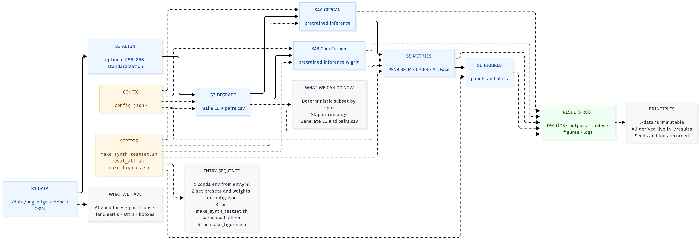
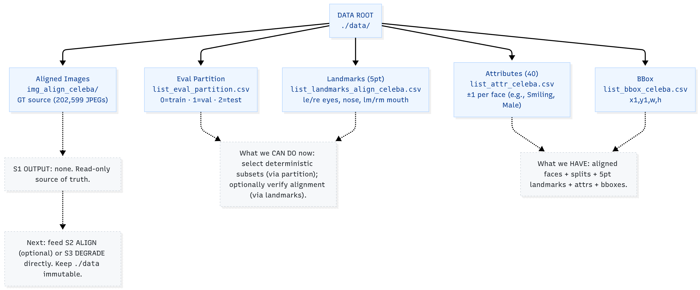
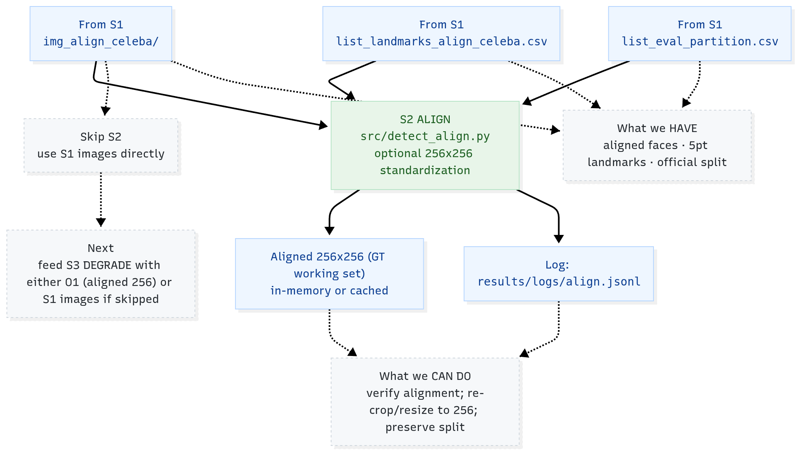
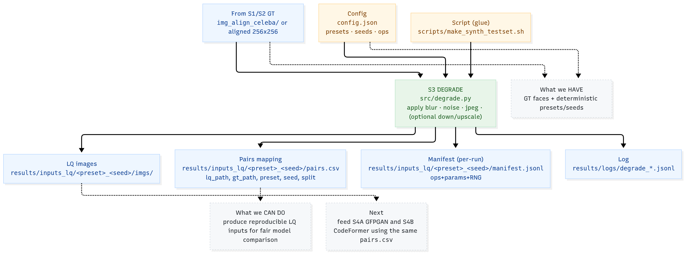
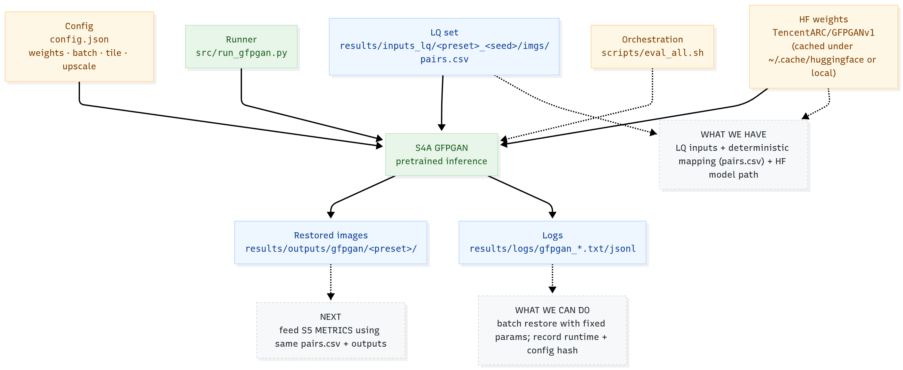
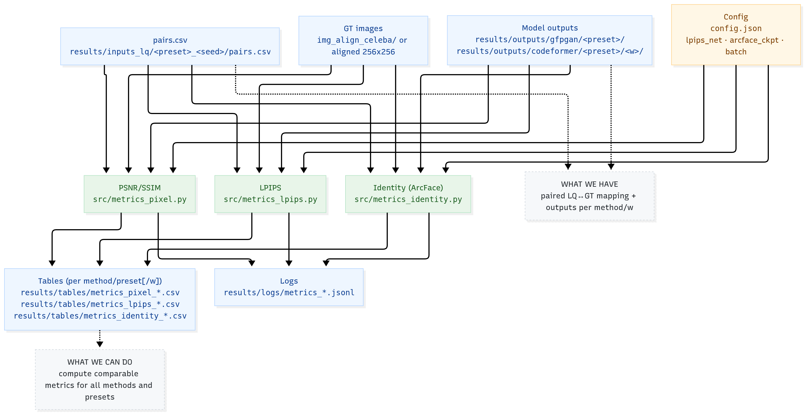
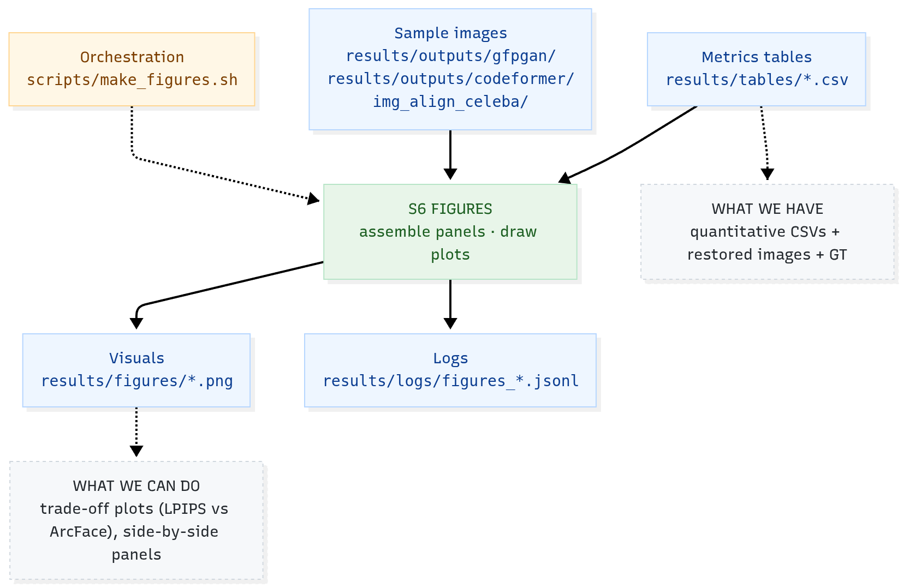
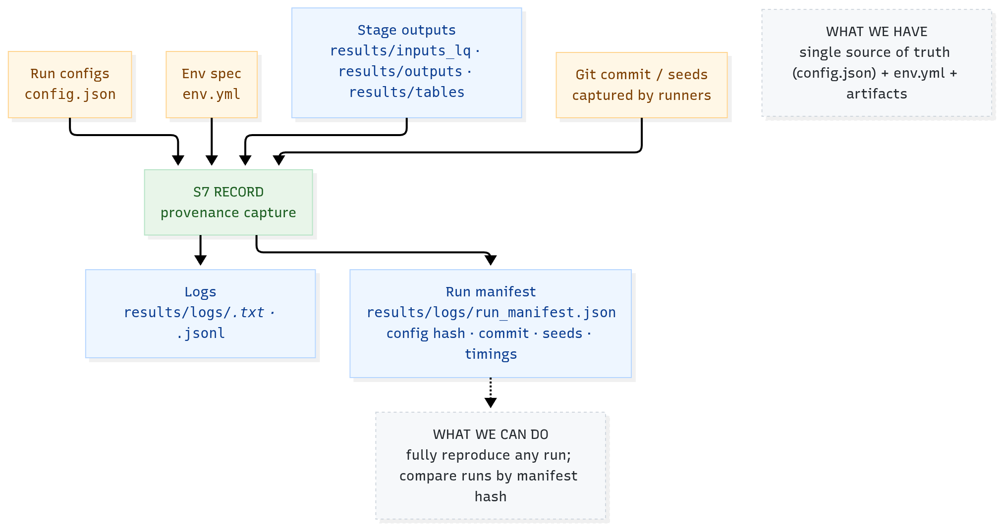

# PIPELINE ROADMAP — GFPGAN VS CODEFORMER (WORKING DRAFT)

Monica Stef
Aidan Sibley

---

## S0 OVERVIEW

* PURPOSE: Comparative study between GFPGAN (TencentARC) and CodeFormer (Zhou et al.) for face restoration
* DATASET: CelebA aligned (single source, no historicals)
* APPROACH: Synthetic degradation → pretrained inference → metric + qualitative comparison
* FRAMEWORK: PyTorch 2.x, conda env, deterministic seeds
* GOAL: Understand trade-offs in fidelity, perceptual realism, and identity preservation

[ADD: simple diagram later showing linear pipeline S1→S7]

---

## S1 DATA INGESTION

* INPUT: ./data/img_align_celeba + metadata CSVs
* PURPOSE: Hold immutable aligned faces for all downstream stages
* REASON: Simplify setup, avoid training data noise from multiple sources
* MODEL: none
* OUTPUT: no file output, read-only source
* FILES:
  list_attr_celeba.csv (attributes)
  list_bbox_celeba.csv (bounding boxes)
  list_landmarks_align_celeba.csv (5 facial keypoints)
  list_eval_partition.csv (split 0/1/2)

[SUGGESTION: add checksum or manifest log for reproducibility]

---

## S2 FACE ALIGNMENT / STANDARDIZATION

* INPUT: images + landmark CSV
* PURPOSE: ensure all faces are spatially consistent (256×256 crops)
* MODEL: facexlib detector (if alignment verified, skip re-run)
* SCRIPT: src/detect_align.py
* OUTPUT: aligned images (temporary or stored in ./results/logs if needed)

[SUGGESTION: skip for midterm if existing alignment sufficient]
[SUGGESTION: if re-align, add deterministic seed + log file]

---

## S3 SYNTHETIC DEGRADATION

* INPUT: aligned faces from S2
* PURPOSE: create low-quality (LQ) versions for restoration input
* MODEL: none (procedural operations: blur, noise, jpeg compression)
* SCRIPT: src/degrade.py
* OUTPUT:
  LQ images in ./results/inputs_lq/<preset>_<seed>/imgs
  mapping pairs.csv (LQ↔GT)
  manifest JSONL (parameters + seed)

[SUGGESTION: start with one preset (blur+jpeg) before adding more]
[SUGGESTION: record seed and RNG for exact reproducibility]

---

## S4A INFERENCE — GFPGAN

* MODEL: TencentARC/GFPGANv1 (official pretrained, CVPR 2021)
  
* INPUT: LQ images (from S3)
* PURPOSE: perform blind face restoration using StyleGAN2-based prior
* SCRIPT: src/run_gfpgan.py
* OUTPUT: restored faces in ./results/outputs/gfpgan/<preset>/
* LOGS: ./results/logs/gfpgan_<timestamp>.txt

[NOTES: download GFPGANv1.pth manually or via wget command from repo]
[SUGGESTION: add option for upscale factor = 2]
[SUGGESTION: optional parameter config via config.json]

---

## S4B INFERENCE — CODEFORMER

* MODEL: sczhou/CodeFormer (transformer architecture with fidelity knob w)
  
* INPUT: same LQ dataset from S3
* PURPOSE: produce restored outputs at varying fidelity-quality balance (0≤w≤1)
* SCRIPT: src/run_codeformer.py
* OUTPUT: ./results/outputs/codeformer/<preset>/<w>/

[SUGGESTION: test w values {0.3, 0.5, 0.7, 1.0}]
[SUGGESTION: align naming with GFPGAN outputs for easy comparison]

---

## S5 METRICS EVALUATION

* PURPOSE: quantify differences between model outputs and ground truth
* INPUT: GT from S2, outputs from S4A/B, mapping pairs.csv
* MODELS USED:
  LPIPS backbone (AlexNet or VGG)
  ArcFace (identity metric)
* SCRIPTS:
  src/metrics_pixel.py (PSNR/SSIM)
  src/metrics_lpips.py (LPIPS)
  src/metrics_identity.py (ArcFace cosine similarity)
* OUTPUT: CSVs under ./results/tables/metrics_<method>_<preset>.csv

[SUGGESTION: keep aggregate means + stddev for each preset/model]
[SUGGESTION: identity metric can also confirm if model hallucinated features]

---

## S6 VISUALIZATION AND FIGURE GENERATION

* PURPOSE: produce side-by-side panels and metric plots
* INPUT: selected outputs + GT + tables
* SCRIPT: scripts/make_figures.sh
* OUTPUT: ./results/figures/*.png
* USE: for midterm report visual presentation

[SUGGESTION: start with one panel (GT, LQ, GFPGAN, CodeFormer w=0.5)]
[SUGGESTION: add bar plots for average LPIPS and ArcFace cosine]

---

## S7 LOGGING AND CONFIGURATION

* PURPOSE: maintain deterministic reproducibility
* FILES:
  config.json (seeds, paths, presets, model paths)
  env.yml (PyTorch version, dependencies)
  results/logs/ (timestamped run logs)

[SUGGESTION: include git commit hash + timestamp at each run]
[SUGGESTION: add checksum of pretrained weights if time allows]

---

NOTES ON MODEL CHOICE

* GFPGANv1 (TencentARC) → generative prior from StyleGAN2, excels at realistic detail
  * Why this model?
    Most stable, penetrated release using a StyleGAN2 prior (known for producing realistic, detailed textures with minimal artifacts). Version 1,4 improves upon v1.3 with better detail and identity consistency, while being easy to run without retraining.
* CodeFormer (Zhou et al.) → transformer with fidelity-quality tradeoff
* Combined comparison exposes trade-offs between GAN-based realism and transformer-based fidelity
  * Why this model?
    Because of its transformer based architecture and fidelity knob (w) which allows fine-grained control between perceptual quality and identity accuracy. It represents a more modern, transformer-driven alternative to GAN priors, ideal for comparative analysis.

[SUGGESTION: capture both quantitative and perceptual contrasts, not just scores]

---

NEXT STEPS

* Download pretrained GFPGANv1.pth and verify inference
* Generate first LQ set using one degradation preset
* Run both models on same LQ inputs
* Compute PSNR, LPIPS, ArcFace similarity
* Create single visual panel for midterm submission

[ADD: short paragraph summary of observations once first batch complete]
[KEEP: this document as a running plan → update stage status as completed]

